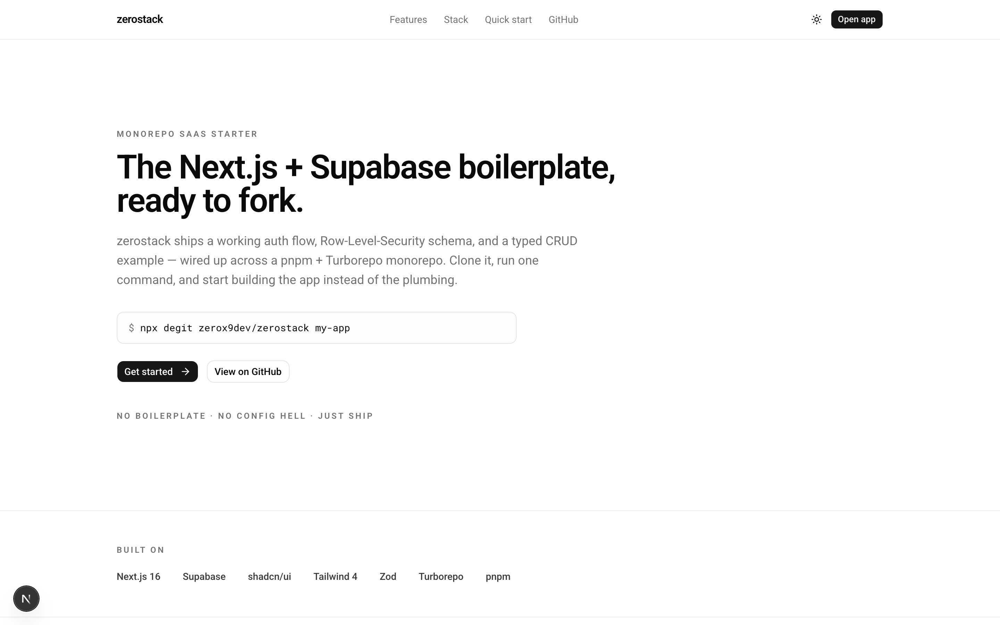

# zerostack

[](https://github.com/zerox9dev/zerostack/actions/workflows/ci.yml)
[](./LICENSE)

A modern, scalable monorepo starter. React everywhere, managed backend, agent-friendly.

**Live demo:** [zerostack-web.vercel.app](https://zerostack-web.vercel.app)

[](https://vercel.com/new/clone?repository-url=https%3A%2F%2Fgithub.com%2Fzerox9dev%2Fzerostack&root-directory=apps%2Fweb&env=NEXT_PUBLIC_SUPABASE_URL,NEXT_PUBLIC_SUPABASE_ANON_KEY&envDescription=Get%20these%20from%20Supabase%20Dashboard%20%E2%86%92%20Settings%20%E2%86%92%20API&envLink=https%3A%2F%2Fsupabase.com%2Fdashboard&project-name=zerostack&repository-name=zerostack)

<picture>
  <source media="(prefers-color-scheme: dark)" srcset="./.docs/screenshot-dark.png">
  
</picture>

## Stack
- **Monorepo** — pnpm workspaces + Turborepo
- **Web** — Next.js 16 (App Router), Tailwind 4, shadcn/ui
- **Contracts** — Zod schemas + inferred types, shared across the repo (single source of truth)
- **Backend** — Supabase (Postgres, auth, storage, realtime, RLS)
- **Mobile** — Expo (planned)

## Structure
```
apps/
  web/             Next.js app (landing + magic-link auth + /app dashboard)
packages/
  contracts/       Zod schemas + types — source of truth
  supabase/        Supabase client + generated DB types
  config/          shared tsconfig base
supabase/
  migrations/      SQL migrations (notes table + RLS as the starting example)
AGENTS.md          instructions for AI agents
```

## What works out of the box
- Magic-link auth (`/login` → email → `/auth/callback` → `/app`)
- Session refresh + protected routes via root `middleware.ts`
- Example `notes` table with per-user RLS and a full CRUD UI on `/app`
- Server Actions everywhere; client input validated against `@zerostack/contracts`

## Requirements
- Node.js 22+
- pnpm 11+
- A Supabase project (free tier is fine)

## Quick start

1. **Install deps**
   ```bash
   pnpm install
   ```

2. **Create a Supabase project** at [supabase.com](https://supabase.com), then in
   **Settings → API** copy the project URL and the `anon` public key.

3. **Configure env**
   ```bash
   cp .env.example apps/web/.env.local
   # fill NEXT_PUBLIC_SUPABASE_URL and NEXT_PUBLIC_SUPABASE_ANON_KEY
   ```

4. **Apply the example migration.** Either:
   - Open `supabase/migrations/20260529000000_init_notes.sql` and paste it into
     the Supabase **SQL Editor**, or
   - Install the [Supabase CLI](https://supabase.com/docs/guides/local-development/cli/getting-started)
     and run `supabase link --project-ref <id> && supabase db push`.

5. **Allow the auth callback.** In Supabase **Authentication → URL Configuration**,
   add `http://localhost:3000/auth/callback` to **Redirect URLs**.

6. **(Optional) generate DB types** — replaces the permissive placeholder in
   `packages/supabase/src/types.ts` with types matching your real schema:
   ```bash
   SUPABASE_PROJECT_ID=<id> pnpm --filter @zerostack/supabase db:types
   ```

7. **Run it**
   ```bash
   pnpm dev          # web on http://localhost:3000
   ```
   Go to `/app`, you'll be redirected to `/login`, enter your email, click the
   link in the inbox, and land on the notes dashboard.

## Production checklist

Quick start gets you running locally. Before pointing real users at a
deployment, work through this list — these are gotchas the dev setup
silently hides.

### Supabase
- **Replace the built-in SMTP.** Supabase's default mailer is for
  development only and rate-limits to ~3–4 emails / hour / address. The
  first time you ask for a magic link in a tight loop you'll hit
  `email rate limit exceeded`. Wire your own SMTP under
  **Project Settings → Authentication → SMTP Settings** —
  [Resend](https://resend.com),
  [Postmark](https://postmarkapp.com), or AWS SES all work; Resend has
  a free tier suitable for low-volume production.
- **Add the production redirect URL.** In **Authentication → URL
  Configuration** add `https://<your-domain>/auth/callback` to
  **Redirect URLs**. Without this Supabase rejects the magic link with
  `redirect_to is not allowed`. Keep `http://localhost:3000/auth/callback`
  in the list so local development still works.
- **Set the Site URL** to your canonical production domain. It's used
  as the fallback when emailRedirectTo is omitted.
- **Lengthen / shorten OTP expiry** if needed (default 1 hour). The
  toggle lives next to the redirect URL list.
- **Tune password and signup policies** under **Authentication →
  Providers → Email** if you ever add password sign-in.
- **RLS, every table.** This template enables it on `notes`. Any table
  you add needs `enable row level security` + explicit policies before
  it's reachable from the anon key. The Supabase dashboard flags
  RLS-disabled tables with a red shield.

### Vercel (or your host)
- **`NEXT_PUBLIC_SITE_URL`** — set this explicitly to your production
  domain (e.g. `https://example.com`). Sitemap, robots, OG, and
  canonical metadata all read from it. Unset, the code falls back to
  `https://${VERCEL_URL}`, which changes per deployment.
- **`NEXT_PUBLIC_SUPABASE_URL` / `NEXT_PUBLIC_SUPABASE_ANON_KEY`** —
  same values as in `.env.local`. Anon key is safe to ship to the
  client; the **service role** key is not — never put it in
  `NEXT_PUBLIC_*`.
- **Custom domain.** Once attached in Vercel, update Supabase Site URL
  and Redirect URLs to match.

### App
- **Regenerate Supabase types** against the real schema: see step 6 in
  Quick start. The placeholder accepts any table at compile time;
  generated types catch typos and breaking schema changes.
- **Pick a real `notes` replacement**, or accept the example as a
  reference and delete it before launch. The schema + RLS pattern is
  the asset, not the table itself.
- **Set up monitoring** — Vercel Analytics, Sentry, or whatever you
  prefer. Not wired in by default to avoid forcing a vendor.

## Scripts (from root)
- `pnpm dev` — run all apps in dev
- `pnpm build` — build all
- `pnpm lint` — lint all
- `pnpm typecheck` — type-check all
- `pnpm --filter <name> <cmd>` — target one package

## For AI agents
Read [AGENTS.md](./AGENTS.md) before working in this repo.

## License
[MIT](./LICENSE)
